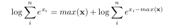
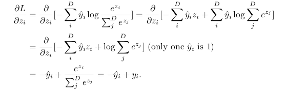
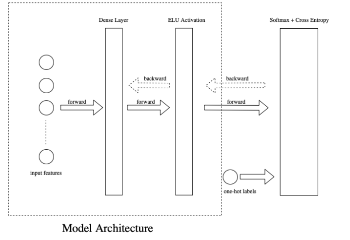

# Neural Nets from Scratch

I have implemented a neural network from scratch to classify handwritten digits using raw pixels as features. I have used the classic MNIST digits dataset.

# Layer Implementation

I have implemented three types of layers for the network: a dense layer that is fully connected with the inputs (the input layer), followed by a ELU layer (a hidden layer), and ending with a SoftmaxCrossEntropy layer (the output layer). I have chosen to deviate from the cliched ReLU and used the ELU instead!

# Final Layer Activation - Softmax Cross entropy

I have used the log-sum-exp trick to prevent overflows in the exponential term of the Softmax function:

  

Hence, the back prop of the softmax can be reduced as follows:

  

# Building the Model

Model.build_model() - builds all layers using the layer object from numpynet.

Model.bprop(logits, labels, istraining=True) - runs the backward propagation through all layers to compute the gradients for all parameters of the model.

Model.update parameters(lr) - updates all trainable parameters in each layer. The input of this function is the learning rate.

  

Training and Testing are done in the usual way.
